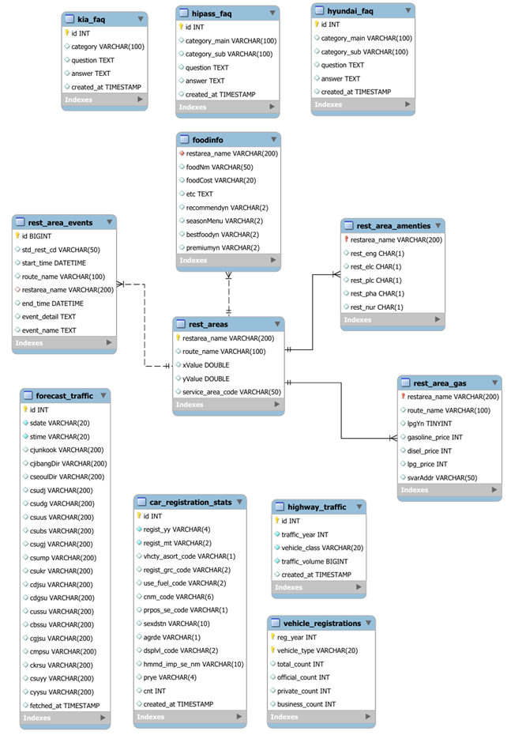
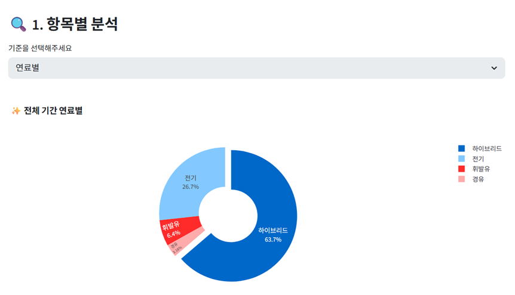
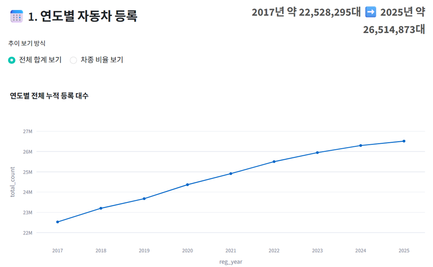
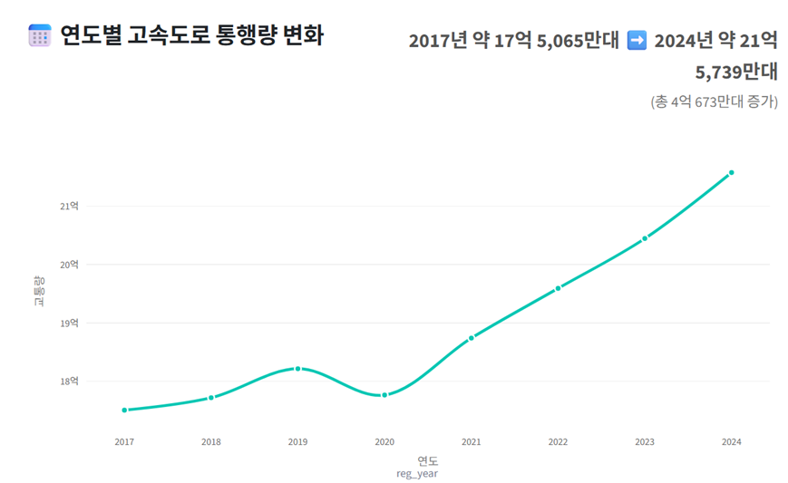
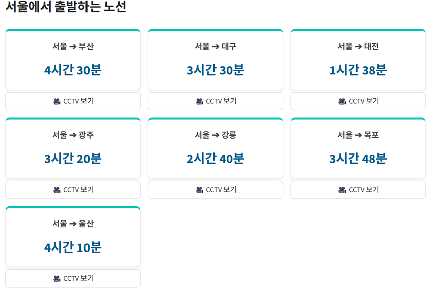
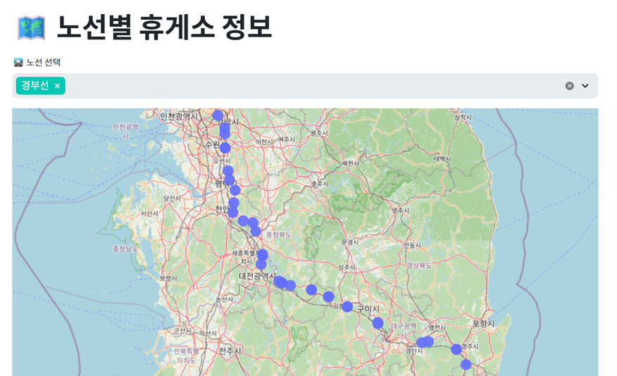
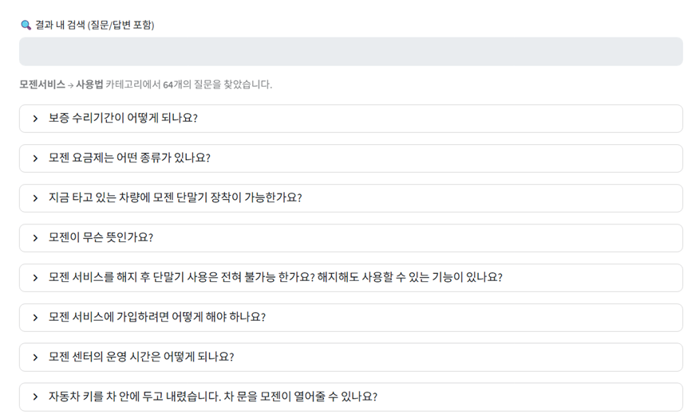

# 데이터 기반 중고차 구매 의사결정 지원 서비스

---

## 팀 구성

<table align="center">
  <tr>
    <td align="center" width="190px"></td>
    <td align="center" width="190px"></td>
    <td align="center" width="190px"></td>
    <td align="center" width="190px"></td>
  </tr>
  <tr>
    <td align="center"><b>윤대성</b></td>
    <td align="center"><b>윤승혁</b></td>
    <td align="center"><b>최지용</b></td>
    <td align="center"><b>한예나</b></td>
  </tr>
  <tr>
    <td align="center"><a href="https://github.com/YoonDaesung-01"></a></td>
    <td align="center"><a href="https://github.com/idenist"></a></td>
    <td align="center"><a href="https://github.com/antisdream"></a></td>
    <td align="center"><a href="https://github.com/hanyena0830"></a></td>
  </tr>
</table>
                                

---
## 실행 환경 (Environment)
> [requirements.txt](./requirements.txt)를 참조
---
## 실행 방법 (How to Run)

### 1) 환경변수 설정

- `.env'에 ""안에는 호스트로부터 제공받은 값을 입력합니다.
- 필요 변수: DB_HOST="", DB_PORT="", DB_USER="", DB_PASSWORD="", DB_NAME_CARMASTER=""
DB_NAME_VEHICLE_YEAR="", DB_NAME_FAQ="", DB_NAME_TRAFFIC=", ITS_API_KEY=""
---
### 2) streamlit 실행
  프로젝트 폴더의 최상단 위치에서 다음 명령어를 실행한다.
```bash
streamlit run app.py
```
---
## ERD



## 구현 화면 (Demo)
### 1) 메인 홈


- txt : 부트캠프 기수, 조 이름, 슬로건, Web 안내사항
- btn : sidebar menu(메인 홈, 등록된 자동차 통계, 연도별 등록 추이, 연도별 고속도로 통행량, 주요 지역 소요 시간, 휴게소 위치 지도, FAQ 게시판)

---

### 2) 등록된 자동차 통계
       (최근 5개월 자동차 신규 등록 통계)



> 1. 항목 분석
  연료별, 차종별, 성별, 연령대별, 국산/외산 비중을 확인 가능 

> 2. 각 항목 월별 분석
  최근 5개월 자동차 신규 등록 통계를 나타내고 있으며,
  연료별, 차종별, 성별, 연령대별, 국산/외산 비중을 확인 가능 

---

### 3) 연도별 등록 추이
       (연도별 자동차 등록 현황 (2017~2025))




> 1. 연도별 자동차 등록
  연도별 전체 합계 꺾은선 그래프와 연도별 차종 누적 등록 대수의 막대형 그래프를 확인 가능

> 2. 연도별 상세 분석
  원하는 연도를 선택하여 파이그래프 형식으로 차종별 비중과 용도별 비중을 확인 가능

---

### 4) 연도별 고속도로 통행량
       (연도별 고속도로 통행량 변화)



> 2017년 ~ 2025년 교통량 변화에 관한 꺾은선 그래프

---

### 5) 주요 지역 소요시간
       (주요 도시 소요시간)




> 서울에서 출발하는 주요 대표 노선, 서울로 도착하는 주요 대표 노선, 기타 노선에 관한 소요시간과 실시간 CCTV 정보

---

### 6) 휴게소 위치 지도
       (노선별 휴게소 정보)




> 각 노선별 항목을 클릭하면 휴게소 명단이 출력되며,
  명단에서 원하는 휴게소 또는 지도에서 원하는 휴게소를 선택하면 그 휴게소에 대한 정보 출력

---

### 7) FAQ 게시판
       (통합 FAQ 게시판)




> 1. 현대자동차
  모젠 서비스, 블루링크, 정비예약, 차량구매, 차량정비, 특허관련, 현대 디지털 키, 홈페이지 FAQ

> 2. 기아자동차
  PBV, 기아멤버스, 기타, 차량 구매, 차량 정비, 홈페이지 FAQ

> 3. 하이패스
  EX모바일충전카드, EX선불카드, 단물기등록, 하이패스서비스

---

## 1. 프로젝트 개요

### 1.1 프로젝트 요약

- 기 : 해마다 꾸준히 증가하는 자동차 등록대수로 인한 고속도로 통행량 증가 발생
- 승 : 고속도로를 이용하는 운전자들의 단순 길 안내를 넘어 고속도로 이용 중 편리한 정보의 제공이 필요
- 전 : 그 중 휴게소는 단순 휴식공간이 아닌 운전자들에게 다양한 정보 및 콘텐츠를 제공함
- 결 : 자동차 등록대수 증가로 인한 운저자들의 고속도로 정보가 필요하기 때문에 휴게소 및 고속도로 내의 정보 제공이 필요하다는 타당성

---

### 1.2 문제 정의

요즘에는 고속도로 내에 위치한 휴게소를 목적지에 가기위해 거쳐가는 곳으로만 이용하지 않고, 다양한 컨텐츠를 즐기러 가기위한 사람들이 증가되고 있음에도 불구하고 정보를 알 수 있는 방법이 한정적이거나 복잡함

---

### 1.3 프로젝트 실행
#### 1.3.1 환경설정 파일 생성 및 확인
`git local`폴더 안에 `.env`파일을 생성한 후에 아래의 예시대로 작성해야 한다.
```.env
DB_HOST="", DB_PORT="", DB_USER="", DB_PASSWORD="", DB_NAME_CARMASTER=""
DB_NAME_VEHICLE_YEAR="", DB_NAME_FAQ="", DB_NAME_TRAFFIC=", ITS_API_KEY=""
```

---

## 2. 핵심 기능

| 구분         | 기능                       | 설명                                          |
|-------------|---------------------------|-----------------------------------------------|
| 동적 크롤링   | CCTV 및 연료값 실시간 연동  | 1시간 내지 간격으로 실시간 정보 확인 가능           |
| 시각화       | map에 option추가          | 각 휴게소별 제공하는 컨텐츠 정보 확인 가능           |
| 시각화       | 연도별 차량 등록 대수 증가   | 연도별 차량 등록 대수 증가를 항복멸 확인 가능        |

---

## 3. 시스템 아키텍처

```
공공데이터 크롤링 → MySQL → Python 분석 → Streamlit 서비스
한국도로공사 크롤링 → MySQL → Python 분석 → Streamlit 서비스
국가데이터처 크롤링 → MySQL → Python 분석 → Streamlit 서비스
```

데이터 수집, 저장, 분석, 시각화 단계를 분리하여 확장성과 유지보수성을 확보함.

---

## 4. 데이터 수집 및 정제

### 4.1 데이터 출처

- 공공데이터 포털, 한국도로공사, 국가데이터처 각 사이트별 Open API에서 크롤링

### 4.2 수집 항목

- **자동차 등록 대수**
    - 연도별 등록 대수
    - 월별 등록 대수
    - 연료별
    - 차종별
    - 성별
    - 연령대별
    - 국산/외산
- **고속도로 정보 관련**
    - 연도별 고속도로 통행량
    - 고속도로 실시간 CCTV
    - 실시간 주요 도시 통행 소요시간
- **휴게소 정보 관련**
    - 휴게소 위치 좌표
    - 휴개소 내 주유소의 실시간 연료값
    - 휴게소 내 컨텐츠 정보
    - 휴게소 내 행사 정보

### 4.3 전처리

- **수치 정규화**
    - 주유값 정수 변환

- **도메인 전처리**
    - 컬럼명을 영어에서 한글로 변환

---

## 5. 데이터베이스 설계
### 5.1 개념 모델 설계
#### 요구 정의서
  - 목적: 고속도로 휴게소 정보, 차량 통계, 연도별 통행량, 구간별 소요시간, FAQ를 통합 제공
  - 주요 기능: 휴게소 위치 조회 및 지도 표시, 연도별/구간별 통계 시각화, 통행량 분석, 소요시간 분석, FAQ.
  - 데이터 출처: 교통 센서/도로공사 API, 공공데이터(통행량·휴게소 목록), 내부 수집(사용자 업로드 CSV), 스케줄링된 배치 수집.

#### 5.1.1 개념 엔티티 정의
  - RestArea: 휴게소(아이디, 이름, 위도, 경도, 도로명, 편의시설 목록, 운영시간)
  - TrafficCount: 통행량(아이디, 휴게소 또는 구간 참조, 측정일시, 차량수, 차종구분)
  - VehicleRegistration: 등록차량 통계(아이디, 연도, 지역, 등록대수, 차량종류)
  - TravelTime: 구간 소요시간(아이디, 구간ID, 측정일시, 평균소요시간, 표준편차)
  - FAQ: 기본적인 안내사항
  - Amenities: 휴게소 편의시설 표준화 테이블(편의시설ID, 이름, 카테고리)

#### 5.1.2 개념 관계
  - RestArea 1 : N TrafficCount (한 휴게소에 여러 통행량 기록)
  - RestArea 1 : N TravelTime (휴게소 인근 구간의 소요시간 기록)
  - Region 1 : N VehicleRegistration (지역별 연도별 등록 통계)

---

### 5.2 논리 모델 설계

```
핵심 테이블 스키마 예시 (논리 모델)
TABLE RestArea (
  rest_area_id SERIAL PRIMARY KEY,
  name VARCHAR(200),
  latitude DECIMAL(9,6),
  longitude DECIMAL(9,6),
  road_name VARCHAR(200),
  amenities JSONB,
  open_hours VARCHAR(100),
  created_at TIMESTAMP,
  updated_at TIMESTAMP
);

TABLE TrafficCount (
  traffic_id SERIAL PRIMARY KEY,
  rest_area_id INT REFERENCES RestArea(rest_area_id),
  measured_at TIMESTAMP,
  vehicle_count INT,
  vehicle_type VARCHAR(50),
  source VARCHAR(100)
);

TABLE TravelTime (
  travel_time_id SERIAL PRIMARY KEY,
  segment_id VARCHAR(100),
  rest_area_id INT REFERENCES RestArea(rest_area_id),
  measured_at TIMESTAMP,
  avg_travel_time_sec INT,
  stddev_travel_time_sec INT
);

TABLE VehicleRegistration (
  reg_id SERIAL PRIMARY KEY,
  year INT,
  region VARCHAR(100),
  vehicle_type VARCHAR(50),
  registered_count INT
);

TABLE FAQ (
  faq_id SERIAL PRIMARY KEY,
  title VARCHAR(300),
  content TEXT,
  author VARCHAR(100),
  tags VARCHAR(200),
  created_at TIMESTAMP,
  updated_at TIMESTAMP
);
```
---

<<<<<<< HEAD
### 5.3 물리 모델 설계
#### 5.3.1 데이터 베이스
5.3.1 데이터 베이스
- 권장 DBMS: PostgreSQL (PostGIS 확장 사용 권장)
=======
### 6.3 물리 모델 설계
#### 6.3.1 데이터 베이스
6.3.1 데이터 베이스
- 권장 DBMS: MySQL
>>>>>>> 3a318935f476b65ebd8aec996ed78abfb12b7d2f
- 저장소 설계:
- 공간 데이터: 휴게소 위치는 geometry(Point)로 저장
- 시간 데이터: 통행량·소요시간은 파티셔닝(예: 연도별 또는 월별) 적용.
- 접근 제어: 최소 권한 원칙, DB 사용자별 권한 분리.

---

<<<<<<< HEAD
## 6. 서비스 UI 흐름
=======
## 7. 데이터 파이프라인
  1. 수집 (Ingest)
    - 실시간/주기적 API 호출: 도로공사/공공데이터 API
    - 센서/로그 수집: 교통 센서 스트림(옵션)
    - 배치 업로드: CSV/엑셀 파일 업로드

  2. 수집 후 처리 (Preprocessing)
    - 스키마 정규화, 결측치 처리, 타임존 정리
    - 좌표계 통일(WGS84), 위경도 유효성 검사
    - 이상치 탐지(예: 차량수 급증) 및 플래그 처리

  3. 저장 (Storage)
    - 원시 데이터: 데이터 레이크 또는 별도 원본 테이블 보관
    - 정제 데이터: 분석용 테이블로 적재 (PostgreSQL/PostGIS)

  4. 변환 및 집계 (Transform)
    - 일/주/월 단위 집계 작업 (Airflow/Cron)
    - 이동 평균, 표준편차, 피크 시간대 계산

  5. 모델/분석 (Modeling)
    - 군집화, 유사도 계산, 예측 모델(선택)

  6. 제공 (Serve)
    - Streamlit 앱에서 쿼리 및 시각화
    - API 엔드포인트(선택)로 외부 제공

  7. 모니터링
    - 파이프라인 실패 알림, 데이터 품질 대시보드
---

## 11. 서비스 UI 흐름
>>>>>>> 3a318935f476b65ebd8aec996ed78abfb12b7d2f
- 사이드바 메뉴 구조 (app.py 기준)
- 메인 홈 (이미지)
- 등록된 자동차 통계 (page_stats)
- 연도별 등록 추이 (page_stats)
- 연도별 고속도로 통행량 (page_traffic)
- 주요 지역 소요 시간 (page_traffic_time)
- 휴게소 정보 (휴게소 상세 페이지; 현재 미구현)
- FAQ 게시판 (page_faq)
- 휴게소 위치 지도 (page_map)
- 페이지별 핵심 UI 요소
- 메인 홈: 대형 배너
- 통계 페이지: 필터(연도, 지역), 시계열 차트, 표 다운로드 버튼
- 통행량 페이지: 연도별 고속도로 통행량 제공
- 소요시간 페이지: 구간별 소요시간 제공 및 분기점 CCTV 제공
- 휴게소 지도: 팝업창에 상세정보(음식, 행사, 기름값 정보)
- FAQ: 질문 검색, 카테고리 필터

---

<<<<<<< HEAD
## 7. GitHub 폴더 구조

=======
## 12. GitHub 폴더 구조
```
>>>>>>> 3a318935f476b65ebd8aec996ed78abfb12b7d2f
PROJECT_1/

├── Crawling/                  # 크롤링 및 데이터 수집 관련 폴더

│   ├── dynamic_crw.ipynb      # FAQ 데이터 크롤링 

│   ├── rest_area2.ipynb       # 휴게소 데이터 정보 수집

│   ├── rest_event.ipynb       # 휴게소 이벤트 데이터 수집

│   ├── rest_gas.ipynb         # 휴게소 주유소 데이터 수집

│   ├── traffic_forecast.ipynb # 교통 예상 시간 데이터 수집

│   └── traffic_upload.py      # 교통 데이터 업로드 스크립트

├── page/                      # Streamlit 각 페이지 모듈 폴더

│   ├── page_faq.py            # FAQ 페이지

│   ├── page_map.py            # 휴게소 위치 지도 페이지

│   ├── page_stats.py          # 자동차 및 통계 페이지

│   ├── page_traffic_time.py   # 주요 지역 소요 시간 페이지

│   └── page_traffic.py        # 고속도로 통행량 페이지

├── picture/                   # 이미지 리소스 폴더

│   ├── ERD.png                # 데이터베이스 설계도

│   ├── highway.png            # 고속도로 배경 이미지

│   ├── readme main background.png # README용 배경 이미지

│   └── (기타 이미지 파일들...)

├── .env                       # 환경 변수 설정 파일 (API 키 등)

├── .gitignore                 # Git 제외 대상 설정 파일

├── app.py                     # Streamlit 메인 실행 파일

├── requirements.txt           # 설치 필요한 라이브러리 목록

├── sidebar.py                 # 사이드바 메뉴 구성 모듈

└── utils.py                   # 공통 유틸리티 함수 모듈

---
<<<<<<< HEAD
=======
```
## 13. 프로젝트 차별성

  - 통합 뷰: 휴게소 위치·편의시설·실시간 통행량·소요시간을 한 화면에서 결합 제공.
  - 경량 배포: Streamlit 기반으로 빠른 프로토타이핑 및 데모 배포 가능.
---
## 14. 한계점
---
## 15. 확장 방향
---
>>>>>>> 3a318935f476b65ebd8aec996ed78abfb12b7d2f
